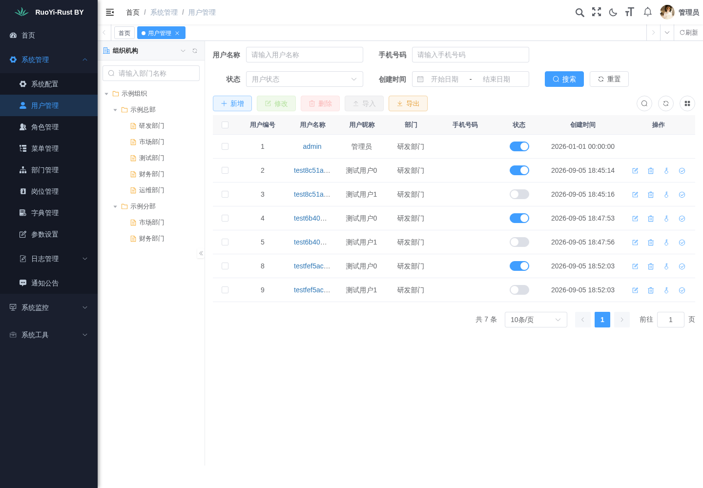

# RuoYi-Rust BY

保留 **RuoYi-Go BY 的 Vue 3 / TypeScript 管理界面**，后端改用 **Rust + Axum + MySQL** 的开源后台管理框架。

[源码](https://github.com/touensan/ruoyi-rust-by) · [v0.2.0 下载包](https://github.com/touensan/ruoyi-rust-by/releases/tag/v0.2.0) · [功能范围](docs/FEATURES.md) · [部署](docs/DEPLOYMENT.md) · [开发与验证](docs/DEVELOPMENT.md)

**v0.2.0 提供对应的 Linux x86_64 Release 运行包（后端与前端已打包）。** 已补齐易支付 V1/V2、SMTP 发送、UTC 定时任务、Redis 缓存监控和 XLSX 用户导入。不是所有 RuoYi-Go BY / Qiluo 功能的完整移植；配置、升级和边界见 [集成说明](docs/INTEGRATIONS.md)。



## 当前源码与下载版本

当前 `main` 的源码版本为 **v0.2.0**，已实现支付、SMTP、定时任务、Redis 监控、XLSX 用户导入和统一后台 RBAC。[v0.2.0 Release](https://github.com/touensan/ruoyi-rust-by/releases/tag/v0.2.0) 包含上述功能与统一后台 RBAC；历史 v0.1.0 包不包含这些更新。 完整对应关系见 [版本与下载状态](docs/VERSIONS.md)。

## 统一后台

本项目与 `ruoyi-xxx-by` 系列统一采用单一后台和 RBAC 权限模型，不拆分用户端、管理端。菜单、路由、页面和接口随角色授权动态控制；管理员继承普通用户基础权限，并叠加管理权限。详见 [架构与权限约定](docs/ARCHITECTURE.md)。

## 界面与功能

前端沿用若依侧栏、标签页、表格、表单、权限按钮和系统配置页面。主要改动限于项目名称、Rust 技术说明、登录退出路径和功能状态提示。

- 一次性 PNG 验证码、bcrypt 密码、登录限速、可撤销 Bearer 会话；数据库只保存令牌 SHA-256 摘要。
- 用户、角色、菜单、部门、岗位、字典、参数、通知公告管理。
- 角色菜单与用户角色关联；全部、自定义部门、本部门、本部门及下级、本人五种用户数据范围。
- 登录日志、操作日志、在线会话与强制退出；基础服务器信息。
- 站点配置、易支付下单/查单/验签通知与订单记录、SMTP 实际发送；密钥 AES-GCM 加密及掩码输出。
- 内置 UTC 定时任务和日志、限定应用前缀的 Redis 监控/清理、事务化 XLSX 用户导入。
- 图片上传与头像，格式重新编码；有权限和数据范围约束的 CSV 导出。
- 数据表元数据导入、Rust 数据模型与分页查询模板预览、ZIP 下载。

详细限制和实现边界见 [FEATURES.md](docs/FEATURES.md)。

## 下载运行包

在 [v0.2.0 发布页](https://github.com/touensan/ruoyi-rust-by/releases/tag/v0.2.0) 下载 `ruoyi-rust-by-v0.2.0-linux-x86_64.tar.gz` 和 `SHA256SUMS`，放在同一目录后执行 `sha256sum -c SHA256SUMS`。解压到独立目录，按 [部署说明](docs/DEPLOYMENT.md) 配置数据库和密钥；已有 v0.1.0 部署先备份，再执行 `./ruoyi-rust-by migrate`。包内 `BUILD_INFO.json` 记录源码提交、工具链和后端摘要。

## 从源码开始

需要 Rust **1.98.1**、MySQL 5.7/8.0；修改前端还需要 Node.js 22。Rust 后端编译为二进制，Vue 前端打包为静态文件；运行时不需要 PHP、Go 或 Node.js。

```bash
git clone https://github.com/touensan/ruoyi-rust-by.git
cd ruoyi-rust-by
cp .env.example .env
cargo run --locked -- keygen
```

将生成的随机值写入 `.env` 的 `APP_KEY`，填写 `DATABASE_URL` 和自己选择的 `ADMIN_INITIAL_PASSWORD`（至少 12 个字符，最多 72 字节）。先创建专用空数据库与数据库用户；不要使用已有业务库。

```bash
cargo run --locked -- init
# 初始化后从 .env 中删除 ADMIN_INITIAL_PASSWORD
cd frontend
npm ci
npm run build:prod
cd ..
mkdir -p public/admin
cp -a frontend/dist/. public/admin/
cargo run --locked --release -- serve
```

访问 `http://127.0.0.1:8000/admin/`，账号 `admin`，密码为初始化时设置的值。**没有通用默认密码**。接口前缀 `/api`。正式使用请配置 HTTPS 反向代理和专用进程用户。

开发前端可在 `frontend` 中运行 `npm run dev`，Vite 将 `/dev-api` 转发到本机 `8000` 端口。

## 项目结构

```text
src/                 Rust API、鉴权、系统管理、配置、生成器
migrations/          SQLx 跟踪的 MySQL 数据库迁移
database/            受控表结构清单、无真实业务数据的初始化种子
frontend/            RuoYi Vue 3 TypeScript 管理端
tests/               真实 MySQL + HTTP 集成测试
scripts/             发布打包与验证辅助脚本
deploy/              Nginx、systemd 部署示例
docs/                架构、验证、部署、功能边界、CI 模板
ai_codex.md          中文项目记忆与交接记录
```

## 参考与致谢

- 主要参考 [touensan/ruoyi-go-by](https://github.com/touensan/ruoyi-go-by)：界面、RuoYi API 协议、菜单与基础数据结构。
- 参考 [chelunfu/qiluo_admin](https://github.com/chelunfu/qiluo_admin)：Rust / Axum 分层、服务端权限与令牌撤销思路。本项目使用 SQLx，不是 Qiluo 的 SeaORM 后端直接改名。
- 参考 [RuoYi-Vue](https://gitee.com/y_project/RuoYi-Vue) 及 RuoYi Vue 3 TypeScript 上游。
- 复用同系列 [ruoyi-php-by](https://github.com/touensan/ruoyi-php-by) 已整理的前端适配和净化数据库定义；服务端代码重新以 Rust 实现。

MIT 开源；原作者版权及依赖许可见 [THIRD_PARTY_NOTICES.md](THIRD_PARTY_NOTICES.md)。欢迎通过 Issues 和 Pull Requests 反馈与贡献。
